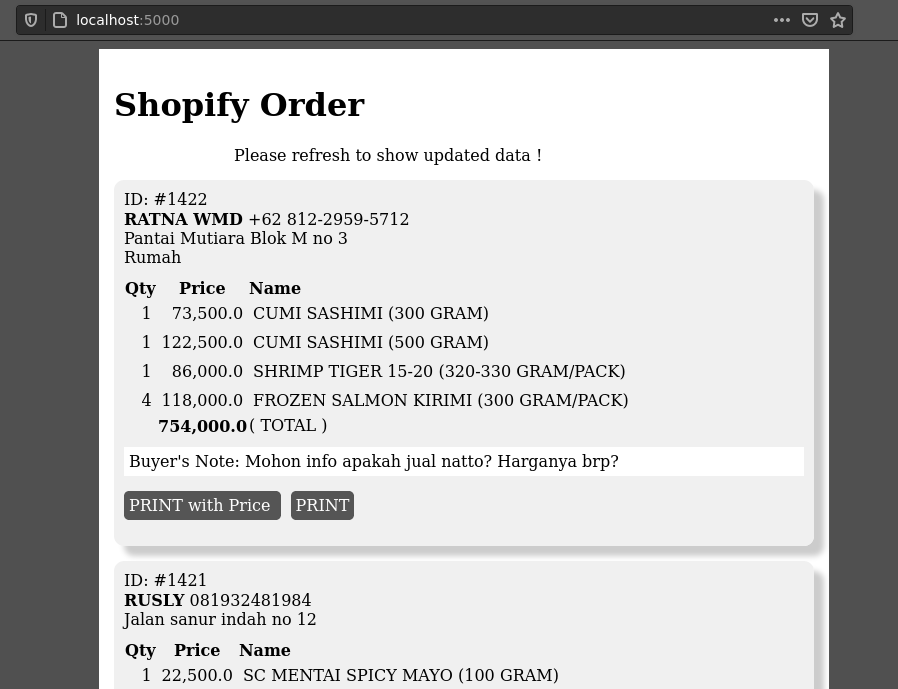

# Shopifrinpy
Print your shopify orders with this single page web from any computer
All you need to set is the Pyton Flask environment and you ready to go !

## Progress
[x] Show unfulfilled orders
[ ] Print each orders
[ ] Print with price info